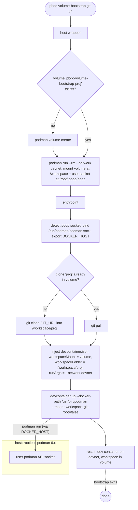

# Architecture

## Flow

## Components

| Component | Detail |
| --- | --- |
| Host wrapper | `~/.local/bin/pbdc-volume-bootstrap` — derives the volume name from the repo name, creates it if needed, and runs the ephemeral bootstrap container. |
| Bootstrap output image | `localhost/pbdc-volume-bootstrap:fedora`, built from `fedora-minimal:latest` with `nodejs`, `npm`, `git`, `podman`, and `@devcontainers/cli`. Never persists; `--rm`. |
| Entrypoint | `src/bootstrap.ts` (TypeScript) compiled to a single `dist/bootstrap.mjs`, baked into the output image — socket binding, clone/pull, JSONC config injection, `devcontainer up`, container/image naming. |
| Toolchain dev container | `.devcontainer/` — a separate, rpm-based image (`fedora-minimal`) with node 22, npm, podman, and uv; used to compile, build the output image, run the e2e test, and generate the docs. Podman talks to the host via the mounted `POOP_SOCKET` / `CONTAINER_HOST`, or builds nested when no socket is present. |
| Workspace | Persistent named podman volume — survives across runs; re-run does `git pull`. |
| Network | `devnet` — both the bootstrap and the dev container join so they can discover each other by name. |

## Key decisions

- **`workspaceMount` injection**: the CLI passes an explicit `workspaceMount`
  verbatim to the container runtime; only its absence triggers the fallback
  `type=bind,source=<host git root>,target=/workspaces/<name>` that breaks for
  volume-based workspaces.
- **`--docker-path /usr/bin/podman`**: the CLI detects podman via
  `<dockerPath> -v`, enabling its `cliVariant="podman"` path
  (`--userns=keep-id`, `--security-opt label=disable`, JSON events) — so no
  docker shim is needed.
- **`--mount-workspace-git-root=false`**: prevents the CLI from trying to
  bind-mount a host checkout that does not exist.
- **Poop socket**: podman 6.x mounts the API socket at `/root/.poop/poop`
  when sockets are enabled via the CLI; the entrypoint binds it to the
  conventional paths and exports `DOCKER_HOST`.